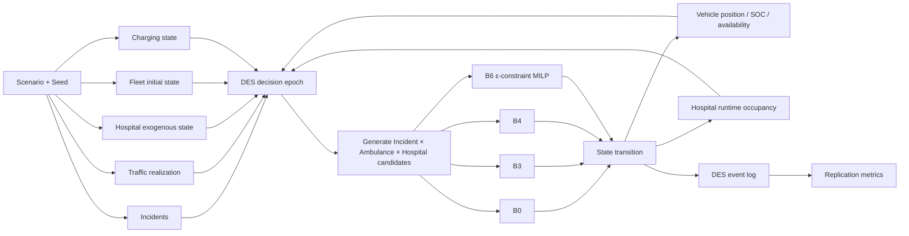
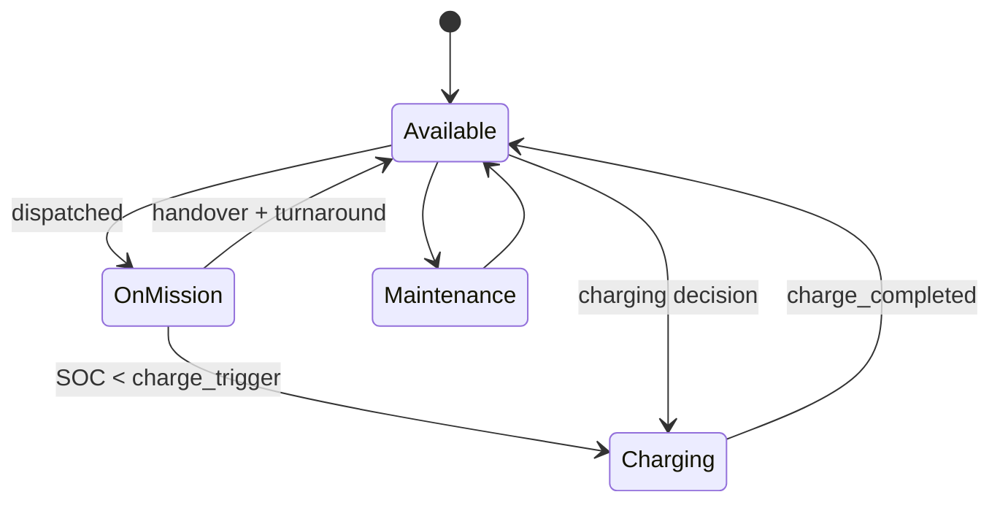

# Thiết kế dataset mô phỏng hoàn chỉnh cho pipeline Incident × Ambulance × Hospital

## Tóm tắt điều hành

Dataset nên được thiết kế như một **bộ dữ liệu mô phỏng có kiểm soát và tái lập**, không phải một bảng 100 mission đã ghép sẵn `vehicle_id → hospital_id`. Đơn vị cơ bản của bài toán phải là một realization ngoại sinh gồm **incident + trạng thái ban đầu của fleet + trạng thái bệnh viện + traffic + charger**, sau đó tại mỗi decision epoch DES sinh tập ứng viên:

\[
\boxed{
Incident_i \times Ambulance_a \times Hospital_h
}
\]

và B0/B3/B4/B6 cùng chạy trên **chính realization đó, cùng random seed**, nhưng tự phát sinh `vehicle_state`, `SOC_before`, `SOC_after`, `available_at` và hospital runtime occupancy của riêng policy. Đây là điểm thiết kế quan trọng nhất: các biến này là **endogenous**, nếu đóng băng chúng thành input chung cho bốn policy thì phép so sánh rolling-horizon bị sai về mặt nhân quả. Cấu trúc này phù hợp trực tiếp với protocol dự án về rolling-horizon ε-constraint MILP, DES, common random scenarios, ablation và repeated replications. fileciteturn0file0

Tôi đề xuất **core experiment 4 scenario**: `normal`, `peak`, `high_demand`, `night`, mỗi scenario **30 replication**. Bộ sample đã tạo sẵn theo đúng yêu cầu định lượng **3 scenario × 30 replication × 100 incidents = 9.000 incidents**, dùng 10 ambulances và 6 hospitals; toàn bộ Cartesian candidate index có:

\[
9{,}000\times10\times6=\mathbf{540{,}000}
\]

tổ hợp `Incident × Ambulance × Hospital`. Mức 10 ambulances/6 hospitals trong sample nhằm giữ package nhỏ; nghiệm chính nên chạy sensitivity khoảng **10–30 ambulances và 5–20 hospitals**, với cấu hình trung tâm 15–20 xe và 10–15 bệnh viện. Project hiện đã curate 15 bệnh viện nội đô với tọa độ và capability, đồng thời chính tài liệu dự án nhấn mạnh tập này không đại diện toàn TP.HCM và hospital capacity trong mô phỏng không phải capacity thực tế. fileciteturn0file3

**Số incident/ngày thực tế hiện tại của mạng 115 TP.HCM: không xác định từ nguồn mở chính thức mà tôi xác minh được.** Một báo cáo lịch sử của thành phố cho biết 6 tháng đầu năm 2019 có 13.961 cuộc gọi và 8.261 bệnh nhân, nhưng hệ thống đã thay đổi đáng kể kể từ đó; đến tháng 8/2025 mạng cấp cứu ngoại viện sau mở rộng được Bộ Y tế ghi nhận có 49 trạm vệ tinh. Vì vậy, **100 incidents/day chỉ nên gọi là controlled benchmark, không phải estimate hiện tại của TP.HCM**. citeturn8search6turn8search13

Một lưu ý phương pháp: để thỏa yêu cầu “đúng 100 incidents mỗi replication”, sample sử dụng **NHPP có điều kiện theo tổng số \(N=100\)**: thời điểm được lấy theo mật độ tỷ lệ với \(\lambda(t)\), nhưng tổng số call bị cố định. Điều này tốt cho benchmark cân bằng giữa policies nhưng làm mất một phần hiệu ứng “high demand” về số lượng. Trong experiment chính, nên có thêm chế độ:

\[
N_d\sim Poisson\left(\int_0^{24h}\lambda(t)\,dt\right)
\]

để `high_demand` thực sự tạo nhiều call hơn, thay vì chỉ làm calls tập trung hơn theo thời gian. Protocol của dự án cũng khuyến nghị non-homogeneous Poisson cho demand và nhiều independent replications thay vì một simulation duy nhất. fileciteturn0file0

### Cấu hình khuyến nghị

| Thành phần | Sample đã tạo | Core experiment khuyến nghị | Sensitivity |
|---|---:|---:|---:|
| Scenarios | 3 | **4** | có thể mở rộng factorial |
| Replication/scenario | **30** | **30** | tối thiểu 20 nếu computationally expensive |
| Incident/rep | **100 fixed-N** | 100 nominal hoặc NHPP random-N | khoảng 60–150/ngày |
| Ambulances | **10** | **15–20** | **10–30** |
| Hospitals | **6** | **10–15** | **5–20** |
| Candidate combinations | **540.000** | phụ thuộc fleet/hospital | tăng tuyến tính theo \(I\times A\times H\) |
| Policies | reference QA | **B0/B3/B4/B6** | ablations A1–A6 |
| Reserve SOC | 20% | 20% nominal | 10/15/20/25/30% |
| Independent seeds | **có** | **bắt buộc** | same seed giữa policies |

Quy mô này có căn cứ thực dụng hơn là cố mô phỏng toàn TP.HCM: mạng 115 thực tế đã lớn hơn rất nhiều so với 10–30 xe của experimental subnetwork, trong khi kế hoạch chính thức của thành phố tiếp tục mở rộng và chuyên nghiệp hóa mạng cấp cứu ngoại viện. Do đó 10–30 xe phải được mô tả là **experimental fleet/subnetwork size**, không phải tổng fleet của thành phố. citeturn8search13turn1search16

## Kiến trúc dữ liệu và schema

### Tách exogenous và endogenous

Đây là kiến trúc nên khóa trước khi viết MILP.



`incident`, traffic realization, hospital exogenous capacity shocks và initial fleet state phải giống nhau giữa B0/B3/B4/B6. Ngược lại, vị trí xe sau mission, SOC, thời điểm rảnh và hospital occupancy là hậu quả của các quyết định trước đó, vì vậy phải được DES cập nhật riêng cho từng policy. Việc tách hai lớp này cũng phù hợp với nghiên cứu electric-ambulance gần đây, nơi SOC/charging được tiến hóa theo trạng thái mô phỏng thay vì xem như một thuộc tính cố định của từng call. citeturn2search1

### Các bảng chính

| Bảng | Vai trò | Cardinality sample |
|---|---|---:|
| `scenarios` | Định nghĩa kịch bản | 3 |
| `replications` | Seed và realization | 90 |
| `incidents` | Calls ngoại sinh | **9.000** |
| `fleet_initial` | Fleet tại \(t_0\) | 900 |
| `hospitals` | Capability tĩnh | 6 |
| `hospital_capacity_timeseries` | Capacity ngoại sinh theo thời gian | 51.840 |
| `charging_stations` | Charger specification | 4 |
| `candidate_index` | Full Cartesian \(I\times A\times H\) | **540.000** |
| `decision_candidates` | Candidate có state thực tại epoch | sinh online/policy |
| `des_event_log` | State transitions | sinh online/policy |
| `policy_runs` | ε, solver, gap, runtime | sinh khi chạy experiment |
| `replication_metrics` | Outcomes | 1 row/policy/rep |

Việc giữ hospital capability tách khỏi hospital capacity là bắt buộc. Capability là thuộc tính kiểu “có khả năng xử trí loại ca này”, còn capacity là trạng thái tiếp nhận biến động theo thời gian. Project hospital dataset đã dùng chính nguyên tắc “có cấp cứu + đúng chuyên môn + còn khả năng tiếp nhận”, và cảnh báo rõ capacity giả lập không được diễn giải thành tình trạng thực tế của bệnh viện. fileciteturn0file3

### Trường dữ liệu theo mức bắt buộc

Data dictionary đã tạo chứa **123 trường/định nghĩa**. Các trường lõi cần khóa như sau.

| Nhóm | Bắt buộc | Khuyến nghị | Optional |
|---|---|---|---|
| Scenario/replication | `scenario_id`, `replication_id`, `random_seed`, `common_random_group`, `start_time`, `end_time`, `generator_version`, `schema_version` | scenario description, calibration version | experiment tag |
| Incident | `incident_id`, `timestamp`, `incident_lat`, `incident_lon`, `priority`, `max_response_time_min`, `incident_type`, `required_specialty`, `service_time_scene_min`, `equipment_energy_kwh` | `urgency_weight`, zone, intensity index | clinical proxy extensions |
| Vehicle initial | `vehicle_id`, lat/lon, `vehicle_state_init`, `soc_init_pct`, `battery_capacity_kwh`, `nominal_consumption_kwh_km`, `reserve_soc_pct`, `available_at_init` | charge trigger/target | SOH, crew shift |
| Vehicle runtime | `candidate_vehicle_id`, `vehicle_state`, `SOC_before_pct`, `SOC_after_pct`, `available_at` | location after event | battery temperature/SOH |
| Hospital | `hospital_id`, lat/lon, `supported_specialties`, emergency receiving flag | nominal model capacity | hospital quality proxies |
| Hospital state | `timestamp_bin`, `capacity_t`, `capacity_state` | `estimated_wait_min` | forecast confidence |
| Travel | distance legs, `freeflow_time`, `congestion_multiplier`, `travel_time` | path/route ID | grade, weather |
| Energy | traction kWh, `equipment_energy_kwh`, reserve, safety energy, charger reach energy | uncertainty buffer | HVAC/payload/regeneration |
| Candidate | `candidate_id`, incident, vehicle, hospital, capability/capacity/SOC/availability flags | SLA flag, rejection reason | score decomposition |
| Solver | `policy_id`, ε bounds, solver version, solve time, MIP gap, objectives | node count | solver diagnostics |
| Provenance | `provenance_id`, `generator_version`, `schema_version`, `source_name`, `source_type` | retrieval date, license, SHA-256 | original raw-record locator |

Các biến EV cốt lõi này tương thích với design nội bộ hiện tại: project đã xác định SOC, battery capacity, consumption, reserve SOC, location, status, available time và toàn chuỗi `vehicle → incident → hospital → charger` là các biến cần thiết để xác nhận energy feasibility. fileciteturn0file2

### Schema runtime candidate

Một row của `decision_candidates` nên có cấu trúc logic:

```text
scenario_id
replication_id
random_seed
policy_id
decision_epoch

incident_id
priority
required_specialty
max_response_time_min

candidate_vehicle_id
vehicle_state
available_at
SOC_before_pct
battery_capacity_kwh
reserve_soc_pct

hospital_id
hospital_capability
capacity_t
capacity_runtime_t
estimated_wait_min

vehicle_to_incident_distance_km
incident_to_hospital_distance_km
hospital_to_nearest_charger_distance_km

freeflow_time_v_i_min
freeflow_time_i_h_min
congestion_multiplier_v_i
congestion_multiplier_i_h
travel_time_v_i_min
travel_time_i_h_min

traction_energy_to_hospital_kwh
equipment_energy_kwh
energy_to_nearest_charger_kwh
energy_uncertainty_buffer_pct
energy_required_safety_kwh

SOC_after_pct
SOC_at_nearest_charger_pct

availability_pass
capability_pass
capacity_pass
SOC_pass
SLA_pass
candidate_feasible_hard

provenance_id
generator_version
schema_version
```

**Không nên lưu `vehicle_state`, `SOC_before` và `SOC_after` trong static candidate index dùng chung cho tất cả policies.** B0 có thể gửi A01 tới H001 lúc 08:05, còn B6 gửi A03 tới H002; từ thời điểm đó trạng thái hai fleet đã khác nhau. Dataset chung chỉ cần `candidate_index`; `decision_candidates` phải được materialize online trong từng policy run.

## Generator, calibration và provenance

### Sinh incident

Generator production nên có hai chế độ.

**Controlled benchmark mode** dùng khi so B0/B3/B4/B6:

\[
N=100,\qquad
t_i\sim\frac{\lambda(t)}{\int\lambda(u)du}
\]

Mục đích là đảm bảo mỗi replication có cùng số call và giảm nhiễu khi so policy.

**Ecological simulation mode** dùng cho robustness:

\[
N_d\sim Poisson(\Lambda_d),\qquad
\Lambda_d=\int_0^{24h}\lambda_d(t)dt
\]

sau đó thời điểm call được lấy theo NHPP. Project protocol cũng đề xuất non-homogeneous Poisson theo hour-of-day/day-of-week và spatial intensity. Stochastic EMS demand bằng Poisson/truncated Poisson có tiền lệ trong literature đã rà soát của dự án. fileciteturn0file0

Nguồn local đủ mạnh để calibration demand hiện vẫn thiếu. Dữ liệu TP.HCM lịch sử năm 2019 chỉ phù hợp làm sanity check, không phù hợp làm estimate hiện tại, nhất là khi mạng cấp cứu đã mở rộng thành 49 trạm vệ tinh sau thay đổi địa giới/hệ thống năm 2025. citeturn8search6turn8search13

Khi cần external parameterization, NEMSIS có public-release research dataset quy mô hơn 63 triệu EMS activations năm 2025, còn NYC EMS Incident Dispatch Data có các timestamp, severity và response milestones ở quy mô hàng chục triệu records. Nhưng cả hai chỉ nên dùng để học **hình dạng distribution hoặc stress ranges**, không được gọi là phân phối của TP.HCM. citeturn4search0turn6search0

### Traffic

Production pipeline nên thay surrogate trong sample bằng:

\[
T_{uv}(t)
=
T^{freeflow}_{uv}\times\gamma_{uv}(t,\omega)
\]

OSMnx có sẵn quy trình bổ sung edge speed và tính free-flow travel time từ chiều dài/speed; chính documentation cũng lưu ý speed imputation cần được hiệu chỉnh khi muốn có travel-time chất lượng tốt. OSM data có ODbL và yêu cầu attribution. citeturn5search2turn5search7

Thứ tự nguồn calibration nên là:

**HCMC official traffic → licensed HERE/Google historical/live travel time → literature/local observations → synthetic multipliers.**

Cổng giao thông TP.HCM đang cung cấp các lớp trạng thái giao thông công khai, nhưng việc “xem công khai” không chứng minh rằng có bulk API/open redistribution license; protocol dự án đã chỉ rõ phải phân biệt publicly viewable, downloadable và openly licensed. fileciteturn0file0

Google Routes cho phép traffic-aware routing dựa trên live/historical traffic models; HERE Traffic API cung cấp flow/congestion và incident feeds. Đây là nguồn calibration khả thi, nhưng phải tuân theo terms/cost và không nên đóng gói dữ liệu dẫn xuất có hạn chế bản quyền vào public benchmark nếu license không cho phép. citeturn7search0turn7search4turn7search1

### Hospital capability và capacity

Capability matrix nên snapshot từ nguồn bệnh viện/cơ quan y tế chính thức và lưu `retrieved_at`, provenance và verification status. Project hiện có 15 bệnh viện với các nhóm tổng quát, trauma, stroke, cardiology, obstetrics, pediatrics, infectious và respiratory; đây là nền tảng phù hợp cho B3/B6 nhưng cần giữ ngày snapshot. fileciteturn0file3

Capacity nên tách:

\[
C_h^{runtime}(t)
=
C_h^{exogenous}(t)
-
Occupancy_h^{policy}(t)
\]

Trong đó `exogenous` phản ánh scenario shock/crowding chung còn occupancy phát sinh do chính policy. Nghiên cứu của Xu et al. cho thấy hospital-state forecasting theo thời gian có thể được tích hợp với destination recommendation; đó là lý do scientific dataset không nên dùng một `capacity` cố định cho cả ngày. citeturn2search2

Nếu chưa có feed TP.HCM, các trạng thái:

```text
normal
constrained
critical
```

phải được ghi rõ `synthetic_scenario`. Sample đang sử dụng các tỷ lệ scenario dựa trên protocol nội bộ: normal 80/20/0, peak 40/40/20 và high-demand 20/40/40 cho normal/constrained/critical. Đây là **assumption thử nghiệm**, không phải dữ liệu hospital occupancy thực. fileciteturn0file3

### SOC và charging

Energy feasibility nên kiểm tra ít nhất:

\[
E^{required}_{aih}
=
(E_{a\rightarrow i}
+E_{i\rightarrow h}
+E_{equipment}
+E_{h\rightarrow charger})
(1+b)
\]

và:

\[
SOC^{charger}_{aih}\ge SOC^{reserve}_a.
\]

Cấu trúc này chính là yêu cầu EV trong project: không được chỉ kiểm tra đủ pin tới patient hoặc hospital mà phải bảo đảm chuỗi sau mission còn khả thi. fileciteturn0file2

Charging DES nên có transition:



Và invariant:

\[
event=\texttt{charging\_completed}
\Rightarrow
SOC_{after}\ge SOC_{before}.
\]

Electric-ambulance simulation gần đây cũng mô hình charging/state evolution trực tiếp trong DES và sử dụng random seeds để tái lập experiments; điều này phù hợp với việc coi charging là state transition thay vì một cột ngẫu nhiên độc lập. citeturn2search1

### Provenance

Mỗi realization cần truy được:

```text
scenario_id
replication_id
random_seed
common_random_group

generator_version
schema_version

source_name
source_type
snapshot_date
license_or_terms
calibration_status
content_hash
```

NEMSIS là ví dụ tốt về việc giữ data-standard/error rules nhưng vẫn công khai rằng dữ liệu có thể chứa lỗi do agencies báo cáo; bài học cho dataset này là provenance không thay thế validation, và validation cũng không được “sửa âm thầm” raw inputs. citeturn4search8

Đối với experiment B0/B3/B4/B6:

\[
seed(B0,s,r)
=
seed(B3,s,r)
=
seed(B4,s,r)
=
seed(B6,s,r)
\]

cho toàn bộ **exogenous random stream**. Đây là common-random-number design cần thiết để paired differences phản ánh policy effect thay vì khác realization. Project protocol cũng yêu cầu các ablation dùng cùng traffic, demand và seed. fileciteturn0file0

## Validation, QA và metrics

### Validation theo tầng

**Schema audit** kiểm tra PK/FK, missing, datatype, timezone, range và uniqueness.

**Physics/operations audit** kiểm tra:

\[
0\le SOC\le100
\]

\[
capacity_t\ge0
\]

\[
charging\_completed
\Rightarrow SOC_{after}\ge SOC_{before}
\]

\[
vehicle\_state=charging
\Rightarrow assignment=0
\]

\[
candidate\_selected
\Rightarrow availability\land capability\land SOC
\]

và nếu capacity là hard constraint:

\[
candidate\_selected\Rightarrow capacity_t>0.
\]

Hospital capability và minimum reserve SOC nên là hard constraints, không phải penalties có thể bị optimizer “mua lại” bằng response-time improvement; đây cũng là formulation được project protocol khuyến nghị. fileciteturn0file0

**DES audit** cần kiểm tra timestamp monotonicity:

\[
t_{call}
\le t_{dispatch}
\le t_{scene}
\le t_{depart}
\le t_{hospital}
\le t_{available}.
\]

Cần test extreme cases: tất cả hospital full, tất cả EV low SOC, một P1 không có vehicle feasible, charger unavailable và zero-demand window.

**Statistical audit** cần kiểm tra distribution theo scenario, priority, hour, zone, hospital capacity và initial SOC. Domain-rule anomaly detection quan trọng hơn một generic ML anomaly detector; robust-z-score/IQR chỉ nên dùng để flag các giá trị như response time, energy/mission và SOC deltas để review.

### Kết quả QA của package đã sinh

Audit hiện tại chạy **16 consistency checks và cả 16 đều PASS**:

- 90 replication;
- 9.000 incidents;
- 9.000 unique incident IDs;
- đúng 100 incidents/scenario-rep;
- 90 unique seeds;
- initial SOC nằm trong \([0,100]\);
- battery capacity dương;
- hospital capacity không âm và không vượt nominal model capacity;
- full candidate index có đúng **540.000 rows**;
- candidate IDs unique;
- reference assignment không chọn xe `charging`;
- không có SOC/capacity violation trong các assignment reference đã chọn.

Đây là QA của **synthetic generator**, không chứng minh dataset đã được calibrate với EMS TP.HCM.

### Metrics bắt buộc trên mỗi replication

| Metric | Định nghĩa |
|---|---|
| `feasible_rate_overall` | served feasible / all incidents |
| `feasible_rate_P1` | feasible P1 / all P1 |
| `feasible_rate_P2` | feasible P2 / all P2 |
| `feasible_rate_P3` | feasible P3 / all P3 |
| `feasible_rate_P4` | feasible P4 / all P4 |
| `SLA_pass_rate` | calls đạt response SLA / all calls |
| `SOC_violation_count` | số assignment phá reserve SOC |
| `hospital_capacity_violations` | số assignment vi phạm capacity rule |
| `assignments_to_charging` | số lần gán xe đang charging; hard-rule model nên = 0 |
| `avg_response_time_min` | mean call→scene |
| `bootstrap95_feasible_low/high` | CI bootstrap trong replication |
| `P95_response_P1` | **nên bổ sung** cho nghiệm chính |
| `time_to_compatible_hospital` | **nên bổ sung** |
| `solver_time_sec` | cho B6 MILP |
| `mip_gap` | cho B6 MILP |

Primary outcome của paper không nên chỉ là mean response time. Protocol nghiên cứu ưu tiên high-urgency tail response, urgency-weighted response, time-to-compatible-hospital, feasible-service rate và energy feasibility. fileciteturn0file0

Bootstrap trong một replication hữu ích cho mô tả variability của 100 calls, nhưng **không được dùng để giả vờ có 1.000 independent experiments bằng cách resample cùng 100 rows**. Statistical comparison B0/B3/B4/B6 nên dựa chủ yếu trên **30 paired replication differences**, dùng scenario-level CI/effect size; bootstrap có thể áp dụng tiếp lên vector paired differences. Đây phù hợp với protocol thống kê hiện tại của dự án. fileciteturn0file0

### Bảng QA reference mẫu

Các con số dưới đây chỉ xuất phát từ **stateless reference feasibility audit** của generator, không phải kết quả B0 và tuyệt đối không phải B6/MILP result.

| Scenario | Mean reference feasible | Mean SLA pass | Mean response |
|---|---:|---:|---:|
| normal | 1,000 | 0,980 | 4,72 phút |
| peak | 0,911 | 0,877 | 5,63 phút |
| high_demand | 0,770 | 0,747 | 5,17 phút |

Việc `SOC_violation_count = 0`, `hospital_capacity_violations = 0` và `assignments_to_charging = 0` ở các selected reference candidates là kết quả của hard filtering, không phải bằng chứng rằng SOC/capacity không ảnh hưởng hệ thống.

Một phát hiện QA quan trọng khác: sensitivity snapshot hiện tại gần như **phẳng khi reserve SOC thay từ 10–30%**. Điều đó cho thấy sample đang stress hospital/capacity mạnh hơn energy. Trước nghiệm B4/B6 chính thức, nên bổ sung `energy_stress` bằng low initial SOC, battery-size range, higher auxiliary consumption hoặc energy uncertainty lớn hơn; nếu không, paper khó chứng minh giá trị marginal của SOC.

## File xuất và visualization

### Dataset đã tạo

**Core exogenous dataset**

- [incidents.csv.gz — 9.000 incidents](sandbox:/mnt/data/eambulance_dataset_v2/data/sample/incidents.csv.gz)
- [replications.csv.gz — 90 replications](sandbox:/mnt/data/eambulance_dataset_v2/data/sample/replications.csv.gz)
- [scenarios.csv.gz](sandbox:/mnt/data/eambulance_dataset_v2/data/sample/scenarios.csv.gz)
- [fleet_initial.csv.gz](sandbox:/mnt/data/eambulance_dataset_v2/data/sample/fleet_initial.csv.gz)
- [hospitals.csv](sandbox:/mnt/data/eambulance_dataset_v2/data/sample/hospitals.csv)
- [hospital_capacity_timeseries.csv.gz](sandbox:/mnt/data/eambulance_dataset_v2/data/sample/hospital_capacity_timeseries.csv.gz)
- [charging_stations.csv](sandbox:/mnt/data/eambulance_dataset_v2/data/sample/charging_stations.csv)

**Full Cartesian index**

- [candidate_index.csv.gz — 540.000 Incident × Ambulance × Hospital keys](sandbox:/mnt/data/eambulance_dataset_v2/data/sample/candidate_index.csv.gz)

`candidate_index` cố ý chỉ là static index. Đây là lựa chọn khoa học: dynamic state phải được tính online riêng cho từng B0/B3/B4/B6.

**Detailed candidate snapshot để kiểm tra schema**

- [normal candidate example](sandbox:/mnt/data/eambulance_dataset_v2/data/sample/candidate_reference_example_normal.csv.gz)
- [peak candidate example](sandbox:/mnt/data/eambulance_dataset_v2/data/sample/candidate_reference_example_peak.csv.gz)
- [high-demand candidate example](sandbox:/mnt/data/eambulance_dataset_v2/data/sample/candidate_reference_example_high_demand.csv.gz)

Ba file này chứa các trường như `vehicle_state`, `SOC_before_pct`, `SOC_after_pct`, free-flow, congestion, capability, `capacity_t`, equipment/traction energy và feasibility flags. Chúng được đánh dấu `INITIAL_STATE_REFERENCE_ONLY`; không được tái sử dụng như dynamic input của B0/B3/B4/B6.

**Relational format**

- [eambulance_sample.sqlite](sandbox:/mnt/data/eambulance_dataset_v2/data/sample/eambulance_sample.sqlite)

### Source code và validation

- [generate_dataset.py](sandbox:/mnt/data/eambulance_dataset_v2/src/generate_dataset.py)
- [validate_dataset.py](sandbox:/mnt/data/eambulance_dataset_v2/src/validate_dataset.py)
- [des_state_machine.py](sandbox:/mnt/data/eambulance_dataset_v2/src/des_state_machine.py)
- [export_parquet.py](sandbox:/mnt/data/eambulance_dataset_v2/src/export_parquet.py)
- [run_sample.sh](sandbox:/mnt/data/eambulance_dataset_v2/scripts/run_sample.sh)
- [run_sample.bat](sandbox:/mnt/data/eambulance_dataset_v2/scripts/run_sample.bat)
- [requirements.txt](sandbox:/mnt/data/eambulance_dataset_v2/requirements.txt)
- [requirements-parquet.txt](sandbox:/mnt/data/eambulance_dataset_v2/requirements-parquet.txt)

### Documentation, provenance và audit

- [Data dictionary — 123 field definitions](sandbox:/mnt/data/eambulance_dataset_v2/data/data_dictionary.csv)
- [Parameter registry](sandbox:/mnt/data/eambulance_dataset_v2/data/parameter_registry.csv)
- [Provenance manifest](sandbox:/mnt/data/eambulance_dataset_v2/provenance/provenance_manifest.json)
- [File inventory + SHA-256](sandbox:/mnt/data/eambulance_dataset_v2/provenance/file_inventory.csv)
- [Validation audit results](sandbox:/mnt/data/eambulance_dataset_v2/validation/audit_results.json)
- [Validation summary](sandbox:/mnt/data/eambulance_dataset_v2/validation/validation_summary.json)
- [Replication QA metrics](sandbox:/mnt/data/eambulance_dataset_v2/results/replication_metrics_reference_QA.csv)
- [Reserve-SOC sensitivity table](sandbox:/mnt/data/eambulance_dataset_v2/results/sensitivity_reference_reserve_soc.csv)

### Storage và runtime đo được

| File/format | Quy mô thực tế | Size xấp xỉ | Vai trò |
|---|---:|---:|---|
| `incidents.csv.gz` | 9.000 rows | **0,78 MB** | primary calls |
| `candidate_index.csv.gz` | 540.000 rows | **3,60 MB** | full Cartesian index |
| detailed candidate/example | 6.000 rows/scenario | **0,73–0,74 MB/file** | schema/debug |
| hospital capacity | 51.840 rows | **0,23 MB** | time-varying states |
| SQLite | core relational tables | **9,10 MB** | query/join/debug |
| metrics | 90 rows | **0,016 MB** | QA results |
| Core generator | 3×30×100 | **13,6 s** trong runtime hiện tại | hardware-dependent |

CSV/GZip phù hợp cho portability và archival. SQLite phù hợp cho debug/relational integrity. **Parquet binary chưa được tạo trong runtime này vì môi trường không có `pyarrow` hoặc `fastparquet`; do đó size và runtime Parquet hiện là “không xác định”.** `export_parquet.py` và `requirements-parquet.txt` đã được tạo sẵn để chuyển toàn bộ CSV sang Parquet/ZSTD trên môi trường có `pyarrow`. Không nên bịa một file `.parquet` giả chỉ để thỏa tên extension.

Trong production, tôi ưu tiên **Parquet partitioned**:

```text
data/
  scenarios/
  incidents/
    scenario_id=normal/
      replication_id=01/
  hospital_state/
    scenario_id=normal/
      replication_id=01/
  candidate_index/
  policy_runs/
    policy_id=B0/
      scenario_id=normal/
        replication_id=01/
    policy_id=B3/
    policy_id=B4/
    policy_id=B6/
  events/
  metrics/
```

SQLite có thể giữ như reproducibility/debug snapshot; CSV giữ cho interchange.

### Sample plots

Biểu đồ Pareto dưới đây chỉ minh họa cách lấy trade-off từ một candidate snapshot; nó **không phải Pareto frontier của ε-constraint MILP B6**.


Trong B6 chính thức, frontier phải được tạo bằng cách thay các \(\varepsilon\)-bounds và giải MILP nhiều lần, rồi ghi objective values, solver gap và computation time. ε-constraint được project protocol chọn vì dễ giải thích trade-off hơn arbitrary weighted sum. fileciteturn0file0

Sensitivity sample:


Đường gần phẳng 10–30% là một **warning**, không phải kết quả tích cực: hiện các ứng viên còn quá dư năng lượng nên SOC chưa tạo đủ tension. B4/B6 chỉ có ý nghĩa khoa học nếu parameter space chứa cả vùng SOC thực sự làm thay đổi feasible set.

## Checklist triển khai và giới hạn còn mở

### Checklist trước khi chạy B0/B3/B4/B6

| Hạng mục | Trạng thái |
|---|---|
| 3 scenarios × 30 reps × 100 incidents | **Đã tạo** |
| 9.000 unique incidents | **Đã tạo** |
| 540.000 full Cartesian candidate keys | **Đã tạo** |
| Seed/scenario/replication provenance | **Đã tạo** |
| Hospital capability subset | **Đã tạo từ project-curated profiles** |
| Time-varying synthetic hospital states | **Đã tạo** |
| Initial fleet SOC/state | **Đã tạo** |
| Equipment energy | **Đã tạo** |
| Constraint-audit script | **Đã tạo** |
| State-transition invariant module | **Đã tạo** |
| SHA-256 inventory | **Đã tạo** |
| CSV/GZip export | **Đã tạo** |
| SQLite export | **Đã tạo** |
| Parquet exporter | **Đã tạo** |
| Actual Parquet binary | **Chưa tạo — runtime thiếu engine** |
| OSMnx real-network matrix | **Chưa calibration** |
| Real HCMC demand distribution | **Không xác định** |
| Real-time HCMC hospital receiving capacity | **Không xác định** |
| EV telemetry calibrated consumption | **Không xác định** |
| `night` fourth scenario | **Khuyến nghị bổ sung** |
| Full B0/B3/B4/B6 rolling DES | **Chưa chạy trong package này** |
| ε-constraint MILP Pareto frontier | **Chưa chạy** |

Trước nghiệm chính, ba việc có mức ưu tiên cao nhất là **thay distance surrogate bằng OSMnx/network travel matrix**, **tăng energy stress để SOC thực sự tác động**, và **triển khai policy-specific DES state evolution**. OSMnx cung cấp một pipeline tái lập tốt cho road graph/free-flow preprocessing, còn traffic calibration có thể sử dụng nguồn local hoặc commercial APIs nếu license cho phép. citeturn5search2turn7search0turn7search1

B0/B3/B4/B6 nên được định nghĩa đúng theo protocol: B0 gần nhất nhưng vẫn phải thỏa hard feasibility; B3 thêm hospital capability/capacity; B4 thêm EV energy/SOC; B6 jointly xét urgency, time, hospital, SOC và uncertainty. Integrated ambulance–hospital assignment và hospital-specialty awareness đã xuất hiện trong literature, trong khi electric-ambulance charging/SOC cũng đã được nghiên cứu trực tiếp; do đó experiment phải chứng minh **marginal value của integration**, không chỉ chứng minh rằng code chạy được. citeturn2search0turn2search1turn3search0

Điểm chưa xác định lớn nhất vẫn là calibration local. Current open-source evidence không đủ để gọi 100 calls/day, capacity states, battery consumption hoặc congestion multipliers trong package là “thông số TP.HCM”. Vì vậy package hiện nên được ghi trong paper là:

> **reproducible synthetic benchmark calibrated where public evidence is available, with explicit scenario assumptions elsewhere.**

Cách ghi này phù hợp với phạm vi khoa học của project: không biến synthetic capacity thành dữ liệu hospital thực, không biến foreign EMS distributions thành estimate của Việt Nam, và không suy luận patient-safety/clinical outcomes từ operational simulation. fileciteturn0file0